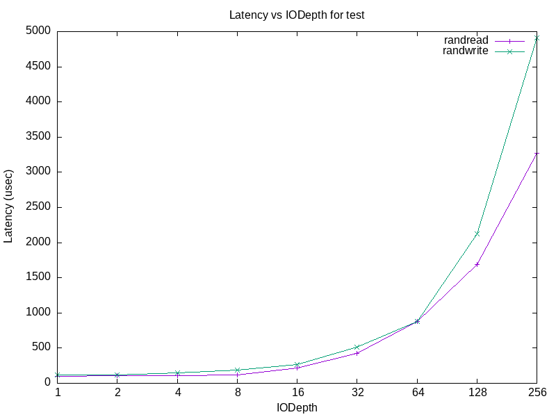

# blktest

Программа запускается в следующем виде:

    ./blktest –name=str –filename=str –output=name

При запуске может жаловаться на невозможность сброса кэша из-за отсутствия прав на это, однако серьёзного влияния на работу программы это не имеет. Легче всего избежать этого уведомления запустить программу с правами администратора.

## Описание графика:

* Данный график может быть полезен для определения оптимального значения iodepth для получения минимальной задержки. Как мне кажется здесь хорошими значениями являются 16 или 32 поскольку значение уже достаточно немаленькое, при этом задержка остаётся низкой.

* Из графика можно убедиться, что операция записи более сложная нежели операция чтения, что особенно проявляется на больших значениях iodepth

* Можно также отметить, что задержка для записи и чтения монотонно возрастает при увеличении iodepth, таким образом на низких значениях 1, 2 и 4 задержка очень маленькая, в то же время на 128 и 256 она уже очень большая. Можно отметить и тот факт, что судя по всему задержка возрастает быстрее чем в 2 раза между значениями, то есть увеличивая iodepth в два раза задержка вырастает более чем в два раза.

